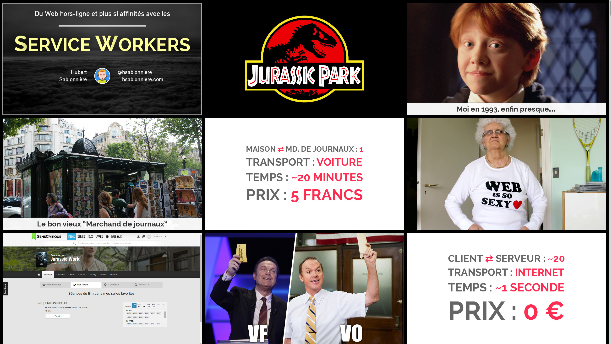

= Du Web hors-ligne et plus si affinités avec les Service Workers (based on Bespoke.js)
Hubert Sablonnière, Dan Allen
// Metadata:
:copyright: 2015-2016 Hubert Sablonnière, Dan Allen
// Settings:
:experimental:
ifndef::env-github[]
:icons: font
endif::[]
:idprefix:
:idseparator: -
ifdef::env-github[]
:caution-caption: :fire:
:important-caption: :exclamation:
:note-caption: :paperclip:
:tip-caption: :bulb:
:warning-caption: :warning:
endif::[]
// URIs:
:uri-asciidoctor-bespoke: https://github.com/asciidoctor/asciidoctor-bespoke
:uri-bespoke: http://markdalgleish.com/projects/bespoke.js/
:uri-bundler: http://bundler.io
:uri-gulp: http://gulpjs.com
:uri-nodejs: https://nodejs.org
:uri-nvm: https://github.com/creationix/nvm
:uri-ruby: https://www.ruby-lang.org
:uri-rvm: http://rvm.io

A port of Hubert Sablonnière's http://hsablonniere.com/talks[presentation on Service Workers] to {uri-bespoke}[Bespoke.js].

The HTML for this presentation is generated from AsciiDoc by the {uri-asciidoctor-bespoke}[Bespoke.js converter for Asciidoctor].
The CSS is generated from Stylus.
SVGs have been optimized using svgo.
The original presentation was based on a modified DZSlides and used Jade and Sass to produce the HTML and CSS, respectively.

IMPORTANT: All rights are reserved for images and diagrams in this presentation except where noted.
You are, however, free to modify and remix the content and styles.

WARNING: Dramatic audio (a dinosaur roar) automatically plays on slide #2.
Adjust your volume accordingly.

//NOTE: The content in this presentation is based on the content from the master branch of the original repository (not the devoxx-en branch).

== Highlights

* A flexbox-based CSS layout (most noticable on slide #1 and any slide that centers content vertically)
* An animation that alternates between two images (slide #2)
* A cover image with optional dark or light caption (slide #2, #36 and many others)
* Content builds with optional fade of past items (slide #5, #9, #13 and many others)
* Auto-fit headings and lists (slide #5, #9, #12, #13 and many others)
* Deep SVG integration (img, object or inline svg) (slide #15, #19, #20 and many others)
  - Auto-play SVG animation (using object) (slide #20, #22, #26, #137, #146)
  - Linear & non-linear SVG content builds (using inline svg) (slide #64, #15, #22, #24, #48, #96)
  - Custom fonts (slide #15, #22, #44, #45, #46, #48, #49, #64, #96, #97)
* Linear & non-linear code builds (slide #43, #47, #67, #80, #83, #144)
* Code annotations/callouts (slide #47, #80, #83, #84, #144)
* Image builds (slide #29, #109, #120)
* Auto-play audio (slide #2, #79)
* Identified, defined and styled several slide types
  - title/closing (slide #1, #152)
  - topic (slide #30)
  - remark (slide #10)
  - image (slide #3)
  - definition (slide #25)
  - code (slide #50)
  - quotation (slide #58)
  - recap (slide #149)
* Overview mode (press kbd:[o])
* Fullscreen mode (press kbd:[f])
* Scales to any screen size, including mobile devices
* Speaker notes per slide (only partially populated atm)

== Improvements

This port improves on the original presentation in the following ways:

* Optimized all SVGs (used menu:File[Save As..., Optimized SVG] in Inkscape, then ran file through svgo)
  - Add the viewbox attribute and removed width and height attributes to enable scaling via CSS
  - The -o.svg suffix means that the SVG has been optimized
* Moved animations into SVGs where possible
  - wifi-4g-o.svg, edge-3g-o.svg, kitchen-wifi-o.svg
* Moved builds into SVG where possible
  - aller-retour-o.svg, kitchen-wifi-o.svg, toilet-wifi-o.svg, appcache-4-o.svg, sw-explained-o.svg, sw-lifecycle-o.svg
* Used different strategies for including SVGs based on functionality required
  inline (`<svg>`):: used when the SVG uses builds (necessary for integration with bespoke-bullets)
  interactive (`<object>`):: used when the SVG uses custom fonts or CSS animations; also used when the SVG has embedded rasters (to work around browser bugs)
  default (``):: used for static SVGs that only consist of drawing objects
* Added CSS stylesheet to SVGs where applicable so they load their own fonts (instead of relying on system fonts) when linked via `<object>` element
* Ensured that any SVG that is being inlined has a unique root class, unique ids and scoped CSS
* Filled in alt text and size information for all images
* Allow block image macro to specify multiple images for a single `<figure>` (to support image fluctuation, for example)
* Automatic smart quotes (and other replacements like ellipsis)
* Author information on title slide is populated from AsciiDoc attributes
* Speaker notes using sidebar blocks with the "cue" role
* Declarative line segmentation using the ``\{zwsp}{nbsp}`` hint and the `%slice` option
  - We may decide to allow double space as an alternate hint
* Declarative fittext using the `%fit` option
* Declarative builds using the `%build` option
  - supports optional fade effect using "fade" role
* Emphasize words using strong/bold formatting marks
* Line-oriented source/listing builds by specifiying build-lines attribute
* Slide image cover using "cover" role; contain using "contain" role
* All font sizes and most spacings are defined in rems (or ems where relevant)
* Speaker notes can optionally be stored together in a separate file
* Provides a more powerful and efficient overview mode (press kbd:[o] to activate)
* 21.6K of link:src/index.adoc[AsciiDoc] (~ 1050 lines) down from 82K of Jade
* 153 slides down from 177 (by leveraging builds)
* CSS: 11.7K, JS: 14.3K, HTML: 133.4K
* Ready to tap into the Bespoke.js https://www.npmjs.com/browse/keyword/bespoke-plugin[plugin ecosystem]

== Known issues

* The presentation is sized to 1280x720 instead of the original 1366x768, so it's not a pixel perfect copy.
* Slide-to-slide transitions currently disabled pending refinement
* Raster images embedded in SVGs sometimes stop appearing in Chrome when the SVG is linked using the `` element.
  - *Solution 1:* Restart your browser.
  - *Solution 2:* Link the SVG using `<object>` (add `opts=interactive` to block image macro in AsciiDoc source).
* Flex layout on title slide jumps around in Firefox (words in h1 element are incorrectly distributed)
* Presenter mode is not yet fully integrated (see <<Adding the presenter console>>).
* Code annotations/callouts show up before the line to which it applies is revealed
It will be available by default once integration with https://github.com/opendevise/bespoke-onstage[bespoke-onstage] is complete.
* Inkscape doesn't like some of the objects in the optimized SVGs, even though they display fine in the browser and image viewer.
  - You must add the width and height attributes on the root `<svg>` element in order to save the file again in Inkscape

== Building the presentation

=== Prerequisites

Ensure you have the following installed on your machine:

For Bespoke.js::
. {uri-nodejs}[Node.js] >= 0.12 footnote:[We strongly recommend using {uri-nvm}[nvm] to manage Node.]
. {uri-gulp}[Gulp] (command line interface only)

 $ npm install -g gulp-cli

For Asciidoctor::

. {uri-ruby}[Ruby] >= 2 footnote:[We strongly recommend using {uri-rvm}[RVM] to manage Ruby.]
. {uri-bundler}[Bundler]

 $ rvm use 2.3.0 --install # (optional)
 $ gem install bundler

=== Setup

Next, clone the repository and switch to the project directory:

 $ git clone https://github.com/opendevise/presentation-service-workers.git
   cd presentation-service-workers

Then, install the required dependencies:

 $ bundle && npm install

Now you're all set to build the presentation!

=== Building the static version

You can build a static version of the slides using the following command:

 $ gulp

The files are built into the _dist_ directory.
You can then view the slides by navigating to _dist/index.html_ in your browser.

=== Launching the preview server

The preview server will monitor files for changes and automatically update the presentation.
You can launch the preview server using:

 $ gulp serve

Once the server is running, you can view the slides by navigating to \http://localhost:8000 in your browser.

== Adding the presenter console

The presenter console is provided by https://github.com/opendevise/bespoke-onstage[bespoke-onstage].
However, since that plugin is not yet released, you must configure it manually.

. Clone bespoke-onstage to _node_modules_:

 $ git clone https://github.com/opendevise/bespoke-onstage node_modules/bespoke-onstage

. Open _src/scripts/main.js_, uncomment the 2 lines that reference the onstage plugin and save it.
. Visit _node_modules/bespoke-onstage/demo/onstage.html_ in your browser.
  - You can switch to the classic DZSlides mode by changing the linked stylesheet.
. Enter the local or remote URI where your presentation is located.
. Present!
